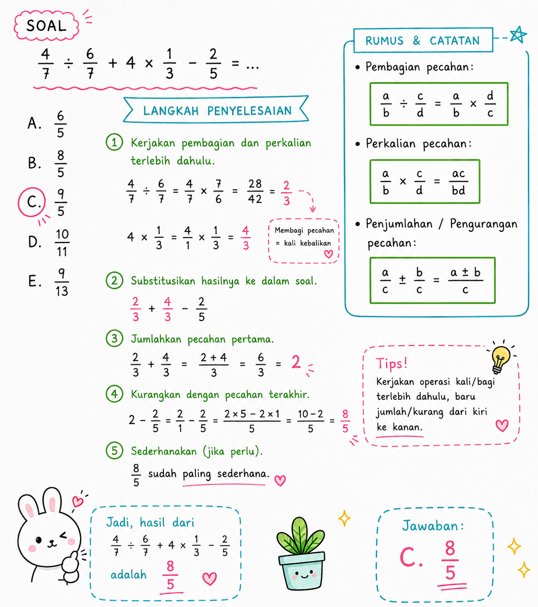

# TIU — Operasi Campuran Pecahan (Bagi, Kali, Tambah, Kurang)

**Kategori:** TIU — Operasi Bilangan
**Tingkat:** Sedang
**ID Soal:** `15dcf6b8`

---

## Soal

Hasil dari $\dfrac{4}{7} \div \dfrac{6}{7} + 4 \times \dfrac{1}{3} - \dfrac{2}{5} = \;?$

- a. 6/5
- **b. 8/5** ✅
- c. 9/5
- d. 10/11
- e. 9/13

---

## Aturan yang Dipakai

1. **× dan ÷** dikerjakan dulu, dari kiri ke kanan.
2. **+ dan −** dikerjakan setelahnya, dari kiri ke kanan.
3. **Bagi pecahan** = kali dengan kebalikannya: $\dfrac{a}{b} \div \dfrac{c}{d} = \dfrac{a}{b} \times \dfrac{d}{c}$.

---

## Pembahasan

### Langkah 1 — Hitung $\dfrac{4}{7} \div \dfrac{6}{7}$

$$\frac{4}{7} \div \frac{6}{7} = \frac{4}{7} \times \frac{7}{6} = \frac{4 \times 7}{7 \times 6} = \frac{4}{6} = \frac{2}{3}$$

### Langkah 2 — Hitung $4 \times \dfrac{1}{3}$

$$4 \times \frac{1}{3} = \frac{4}{3}$$

### Langkah 3 — Substitusi hasil ke soal

$$= \frac{2}{3} + \frac{4}{3} - \frac{2}{5}$$

### Langkah 4 — Jumlahkan dua pecahan dengan penyebut sama dulu

$$\frac{2}{3} + \frac{4}{3} = \frac{6}{3} = 2$$

### Langkah 5 — Kurangkan dengan $\dfrac{2}{5}$

Samakan penyebut ke 5:

$$2 = \frac{10}{5}$$

$$\frac{10}{5} - \frac{2}{5} = \frac{8}{5}$$

---

## Jawaban

$$\boxed{b. \; \frac{8}{5}}$$

---

## Catatan Visual

---

## Konsep Kunci

- **Bagi pecahan** → balik penyebut & pembilang pembaginya, lalu kali.
- **Bilangan bulat × pecahan** → kalikan bilangan bulat dengan pembilang saja. $4 \times \dfrac{1}{3} = \dfrac{4}{3}$ (bukan $\dfrac{4}{12}$).
- **Bilangan bulat sebagai pecahan** → $2 = \dfrac{2}{1} = \dfrac{10}{5}$ kalau mau samakan dengan penyebut 5.
- **Strategi:** kalau ada pecahan dengan penyebut sama (di sini $\dfrac{2}{3}$ dan $\dfrac{4}{3}$), jumlahkan dulu — lebih simpel.

---

## Jebakan Umum

- ❌ **Tidak mendahulukan × dan ÷** → langsung jumlahkan dari kiri ke kanan = jawaban salah.
- ❌ **Salah membalik pecahan saat bagi** → membalik yang dibagi, padahal yang dibalik adalah pembagi (yang di belakang ÷).
- ❌ **$4 \times \dfrac{1}{3} = \dfrac{4}{12}$** → SALAH. Yang benar $\dfrac{4}{3}$ (cuma pembilang yang dikali).
- ❌ **Lupa menyamakan penyebut** saat mengurangkan $2 - \dfrac{2}{5}$.
