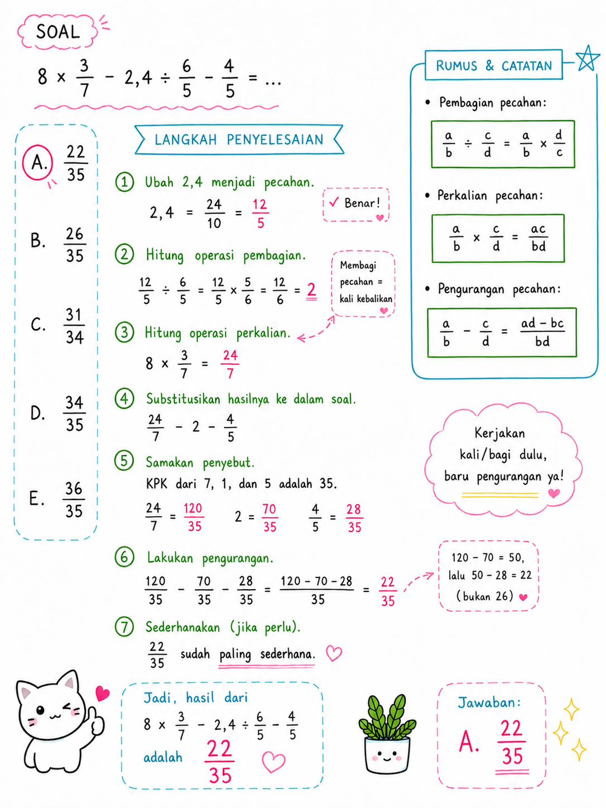

# TIU — Operasi Campuran (Bilangan Bulat × Pecahan, Desimal ÷ Pecahan)

**Kategori:** TIU — Operasi Bilangan
**Tingkat:** Sedang
**ID Soal:** `1e743520`

---

## Soal

Hasil dari $8 \times \dfrac{3}{7} - 2{,}4 \div \dfrac{6}{5} - \dfrac{4}{5} = \;?$

- **A. 22/35** ✅
- B. 26/35
- C. 31/34
- D. 34/35
- E. 36/35

---

## Aturan yang Dipakai

1. **× dan ÷** dikerjakan dulu dari kiri ke kanan.
2. **+ dan −** dikerjakan setelahnya dari kiri ke kanan.
3. **Bilangan bulat × pecahan**: $n \times \dfrac{a}{b} = \dfrac{n \times a}{b}$.
4. **Desimal ÷ pecahan**: ubah desimal jadi pecahan dulu, lalu bagi pecahan = kali kebalikannya.

---

## Pembahasan

### Langkah 1 — Hitung $8 \times \dfrac{3}{7}$

$$8 \times \frac{3}{7} = \frac{8 \times 3}{7} = \frac{24}{7}$$

### Langkah 2 — Hitung $2{,}4 \div \dfrac{6}{5}$

Ubah $2{,}4$ jadi pecahan:

$$2{,}4 = \frac{24}{10} = \frac{12}{5}$$

Bagi pecahan = kali dengan kebalikannya:

$$\frac{12}{5} \div \frac{6}{5} = \frac{12}{5} \times \frac{5}{6} = \frac{60}{30} = 2$$

### Langkah 3 — Substitusi hasil ke soal

$$= \frac{24}{7} - 2 - \frac{4}{5}$$

### Langkah 4 — Samakan penyebut

KPK dari **7**, **1**, dan **5** adalah **35**.

$$\frac{24}{7} = \frac{24 \times 5}{7 \times 5} = \frac{120}{35}$$

$$2 = \frac{2 \times 35}{35} = \frac{70}{35}$$

$$\frac{4}{5} = \frac{4 \times 7}{5 \times 7} = \frac{28}{35}$$

### Langkah 5 — Hitung hasilnya

$$= \frac{120}{35} - \frac{70}{35} - \frac{28}{35} = \frac{120 - 70 - 28}{35} = \frac{22}{35}$$

---

## Jawaban

$$\boxed{A. \; \frac{22}{35}}$$

---

## Catatan Visual

---

## Konsep Kunci

- **Desimal ke pecahan:** geser koma sesuai jumlah angka di belakang koma. $2{,}4 = \dfrac{24}{10} = \dfrac{12}{5}$ (sederhanakan).
- **Bilangan bulat × pecahan:** cukup kali pembilangnya. $8 \times \dfrac{3}{7} = \dfrac{24}{7}$ (bukan $\dfrac{24}{56}$).
- **KPK dari 7 dan 5:** keduanya prima → KPK = $7 \times 5 = 35$.
- **Strategi:** kalau salah satu hasil operasi sudah bilangan bulat (di sini 2), substitusi langsung supaya lebih bersih.

---

## Jebakan Umum

- ❌ Mengerjakan **−** sebelum **× / ÷** → urutan operasi terbalik, hasil ngawur.
- ❌ **$2{,}4 \div \dfrac{6}{5} = \dfrac{2{,}4 \times 5}{6}$** dengan koma → lebih aman ubah ke pecahan dulu.
- ❌ Lupa menyederhanakan $\dfrac{24}{10}$ menjadi $\dfrac{12}{5}$ — masih bisa dihitung sih, tapi lebih ribet.
- ❌ Salah KPK: pakai 70 atau 14 → akan tetap dapat hasil yang benar tapi pecahan jadi besar dan butuh disederhanakan.
- ❌ **Salah tanda:** $120 - 70 - 28 = 22$, bukan $120 - 70 + 28 = 78$.
