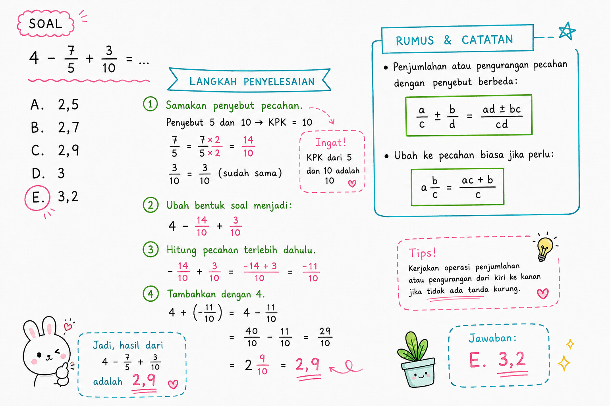

# TIU — Operasi Hitung Pecahan Sederhana

**Kategori:** TIU — Operasi Bilangan
**Tingkat:** Mudah
**ID Soal:** `735cda6e`

---

## Soal

Hasil dari $4 - \dfrac{7}{5} + \dfrac{3}{10} = \;?$

- a. 2,5
- b. 2,7
- **c. 2,9** ✅
- d. 3
- e. 3,2

---

## Aturan yang Dipakai

1. **+ dan −** prioritasnya sama → dikerjakan dari kiri ke kanan.
2. Pecahan hanya bisa dijumlahkan / dikurangkan kalau **penyebutnya sama**.
3. **Samakan penyebut** dengan KPK dari semua penyebut.

---

## Pembahasan

### Langkah 1 — Cari KPK dari penyebut

Penyebut yang ada: **1** (dari 4), **5** (dari 7/5), dan **10** (dari 3/10).

$$\text{KPK}(1, 5, 10) = 10$$

### Langkah 2 — Samakan penyebut ke 10

$$4 = \frac{40}{10}$$

$$\frac{7}{5} = \frac{7 \times 2}{5 \times 2} = \frac{14}{10}$$

$$\frac{3}{10} = \frac{3}{10} \quad \text{(sudah)}$$

### Langkah 3 — Substitusi dan hitung

$$\frac{40}{10} - \frac{14}{10} + \frac{3}{10} = \frac{40 - 14 + 3}{10} = \frac{29}{10}$$

### Langkah 4 — Ubah ke desimal

$$\frac{29}{10} = 2{,}9$$

---

## Jawaban

$$\boxed{c. \; 2{,}9}$$

---

## Catatan Visual

---

## Konsep Kunci

- **KPK** = Kelipatan Persekutuan Terkecil → digunakan untuk menyamakan penyebut.
- **Bilangan bulat sebagai pecahan:** $n = \dfrac{n}{1}$, jadi mudah disamakan ke penyebut apapun.
- **Pecahan ke desimal:** bagi pembilang dengan penyebut. Contoh: $\dfrac{29}{10} = 29 \div 10 = 2{,}9$.

---

## Jebakan Umum

- ❌ Langsung mengurangi $4 - \dfrac{7}{5}$ tanpa menyamakan penyebut → hasil ngawur.
- ❌ Salah cari KPK (misal pakai 5 padahal ada penyebut 10).
- ❌ Lupa bahwa $4 = \dfrac{40}{10}$ (bukan $\dfrac{4}{10}$).
- ❌ Salah tanda saat menjumlah/kurang pembilang: $40 - 14 + 3 = 29$, bukan $40 - 14 - 3$.
