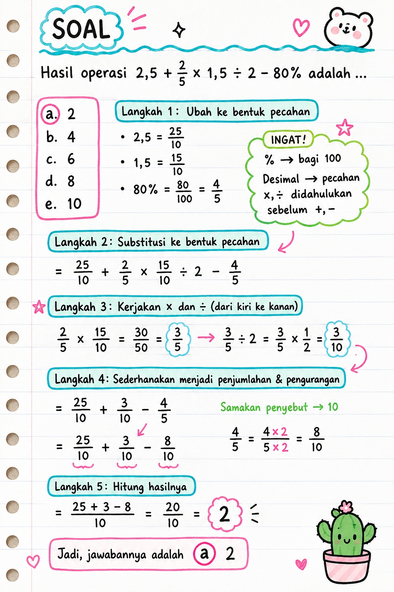
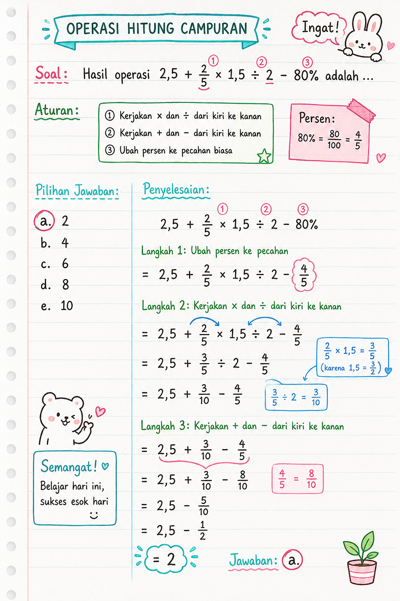

# TIU — Operasi Hitung Campuran (Pecahan, Desimal & Persen)

**Kategori:** TIU — Operasi Bilangan
**Tingkat:** Mudah – Sedang
**ID Soal:** `a91dec30`

---

## Soal

Hasil operasi $2{,}5 + \dfrac{2}{5} \times 1{,}5 \div 2 - 80\\%$ adalah ...

- **a. 2** ✅
- b. 4
- c. 6
- d. 8
- e. 10

---

## Aturan yang Dipakai

1. Kerjakan **× dan ÷** dari kiri ke kanan (prioritas lebih tinggi).
2. Kerjakan **+ dan −** dari kiri ke kanan (setelah × dan ÷ selesai).
3. **Ubah persen ke pecahan biasa** dulu agar mudah dihitung.

---

## Pembahasan

### Langkah 1 — Ubah ke bentuk pecahan

$$2{,}5 = \frac{25}{10}, \quad 1{,}5 = \frac{15}{10}, \quad 80\\% = \frac{80}{100} = \frac{4}{5}$$

### Langkah 2 — Substitusi ke bentuk pecahan

$$= \frac{25}{10} + \frac{2}{5} \times \frac{15}{10} \div 2 - \frac{4}{5}$$

### Langkah 3 — Kerjakan × dan ÷ (kiri ke kanan)

$$\frac{2}{5} \times \frac{15}{10} = \frac{30}{50} = \frac{3}{5}$$

$$\frac{3}{5} \div 2 = \frac{3}{5} \times \frac{1}{2} = \frac{3}{10}$$

### Langkah 4 — Sederhanakan menjadi penjumlahan & pengurangan

$$= \frac{25}{10} + \frac{3}{10} - \frac{4}{5}$$

Samakan penyebut ke 10:

$$\frac{4}{5} = \frac{4 \times 2}{5 \times 2} = \frac{8}{10}$$

$$= \frac{25}{10} + \frac{3}{10} - \frac{8}{10}$$

### Langkah 5 — Hitung hasilnya

$$= \frac{25 + 3 - 8}{10} = \frac{20}{10} = 2$$

---

## Jawaban

$$\boxed{a. \; 2}$$

---

## Catatan Visual

---

## Konsep Kunci

- **Urutan operasi (BODMAS/PEMDAS versi Indonesia):**
  1. Kurung
  2. Pangkat / akar
  3. **× dan ÷** (kiri → kanan)
  4. **+ dan −** (kiri → kanan)
- **Persen ke pecahan:** $p\\% = \dfrac{p}{100}$
- **Pembagian pecahan:** $\dfrac{a}{b} \div c = \dfrac{a}{b} \times \dfrac{1}{c}$
- **Desimal ke pecahan:** geser koma, pakai penyebut 10, 100, 1000, dst.

---

## Jebakan Umum

- ❌ Mengerjakan **+** sebelum **× / ÷**.
- ❌ Lupa mengubah **80%** menjadi $\dfrac{4}{5}$ atau $0{,}8$ sebelum dikurangkan.
- ❌ Lupa menyamakan penyebut sebelum menjumlahkan / mengurangkan pecahan.
- ❌ Mengira $\dfrac{3}{5} \div 2 = \dfrac{3}{10}$ itu salah — padahal benar (bagi 2 = kali $\dfrac{1}{2}$).
